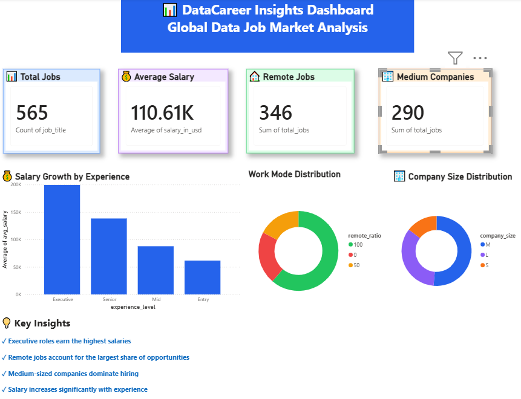

# 🚀 DataCareer Insights

## End-to-End Data Engineering Project

DataCareer Insights is an end-to-end Data Engineering project that analyzes global Data Science, Analytics, and Data Engineering salary trends. The project demonstrates the complete data engineering lifecycle, including data extraction, cleaning, database integration, SQL analytics, automated reporting, and business intelligence dashboarding using Power BI.

---

## 📊 Dashboard Preview



---

## 📌 Project Objectives

This project aims to answer key questions in the Data job market:

* Which data roles offer the highest salaries?
* How does experience level impact compensation?
* What percentage of jobs are remote, hybrid, or onsite?
* How does company size affect job opportunities?
* What insights can job seekers gain from salary trends?

---

## 🛠️ Technology Stack

| Category              | Tools                |
| --------------------- | -------------------- |
| Programming           | Python               |
| Data Processing       | Pandas               |
| Database              | PostgreSQL           |
| Database Connectivity | SQLAlchemy, Psycopg2 |
| Query Language        | SQL                  |
| Version Control       | Git                  |
| Repository Hosting    | GitHub               |
| Visualization         | Power BI             |

---

## 📂 Project Structure

```text
DataCareer-Insights/
│
├── analytics/
│   ├── top_paying_jobs.py
│   ├── salary_by_experience.py
│   ├── remote_analysis.py
│   └── company_size_analysis.py
│
├── data/
│   ├── ds_salaries.csv
│   ├── cleaned_ds_salaries.csv
│   ├── top_paying_jobs.csv
│   ├── salary_by_experience.csv
│   ├── remote_analysis.csv
│   └── company_size_analysis.csv
│
├── etl/
│   ├── load_data.py
│   ├── clean_data.py
│   ├── load_to_postgres.py
│   └── test_db_connection.py
│
├── sql/
│   ├── top_paying_jobs.sql
│   ├── salary_by_experience.sql
│   └── remote_work_analysis.sql
│
├── dashboard/
├── docs/
├── screenshots/
│   └── dashboard.png
├── README.md
├── requirements.txt
└── .gitignore
```

---

## 🔄 ETL Pipeline Architecture

```text
Raw CSV Dataset
        ↓
Python (Pandas)
        ↓
Data Cleaning & Validation
        ↓
PostgreSQL Database
        ↓
SQL Analytics
        ↓
Automated CSV Reports
        ↓
Power BI Dashboard
        ↓
Business Insights
```

---

## 🧹 Data Cleaning Process

The dataset was cleaned and transformed using Python and Pandas.

### Cleaning Activities

* Removed unnecessary columns
* Removed duplicate records
* Validated missing values
* Standardized dataset structure
* Prepared analytical dataset for PostgreSQL

### Dataset Statistics

| Description      | Count |
| ---------------- | ----- |
| Original Records | 607   |
| Cleaned Records  | 565   |
| Removed Records  | 42    |

---

## 📈 SQL Analytics Performed

The project includes analytical SQL queries for:

* Highest Paying Job Titles
* Salary by Experience Level
* Remote Work Distribution
* Company Size Analysis

---

## 📊 Power BI Dashboard Features

The dashboard provides an interactive view of global data job market trends.

### KPI Cards

* Total Jobs
* Average Salary
* Remote Jobs
* Medium Companies

### Visualizations

* Salary Growth by Experience Level
* Work Mode Distribution (Remote, Hybrid, Onsite)
* Company Size Distribution
* Key Business Insights

---

## 📊 Key Business Insights

### Top Paying Roles

| Rank | Job Title                | Average Salary (USD) |
| ---- | ------------------------ | -------------------- |
| 1    | Principal Data Engineer  | 328,333              |
| 2    | Financial Data Analyst   | 275,000              |
| 3    | Principal Data Scientist | 215,242              |
| 4    | Director of Data Science | 195,074              |
| 5    | Data Architect           | 177,874              |

### Remote Work Analysis

| Work Type | Jobs |
| --------- | ---- |
| Remote    | 346  |
| Hybrid    | 98   |
| Onsite    | 121  |

**Insight:** More than 61% of jobs in the dataset were fully remote.

### Company Size Analysis

| Company Size | Jobs |
| ------------ | ---- |
| Medium       | 290  |
| Large        | 193  |
| Small        | 82   |

**Insight:** Medium-sized companies posted the highest number of job opportunities.

---

## 🎯 Project Highlights

* Processed and analyzed 565 real-world job records
* Built an automated ETL pipeline using Python and PostgreSQL
* Developed SQL-based analytical reports
* Created an interactive Power BI dashboard for business insights
* Implemented Git and GitHub version control
* Generated actionable insights from real-world salary data

---

## 🏆 Skills Demonstrated

* Data Engineering
* ETL Development
* Data Cleaning
* Data Transformation
* SQL Query Optimization
* PostgreSQL Database Management
* Data Analysis
* Business Intelligence
* Power BI Dashboard Development
* Git Version Control
* GitHub Collaboration

---

## 📌 Project Status

✅ Data Extraction

✅ Data Cleaning

✅ PostgreSQL Integration

✅ Data Loading

✅ SQL Analytics

✅ Power BI Dashboard

✅ GitHub Deployment

✅ Documentation

---

## 👨‍💻 Author

**Sumeet Gupta**

Aspiring Data Engineer | Python Developer | SQL Enthusiast

GitHub: https://github.com/sumeet2436
