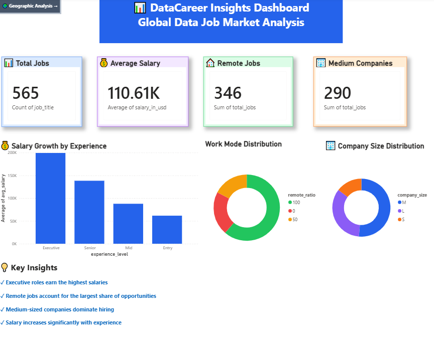
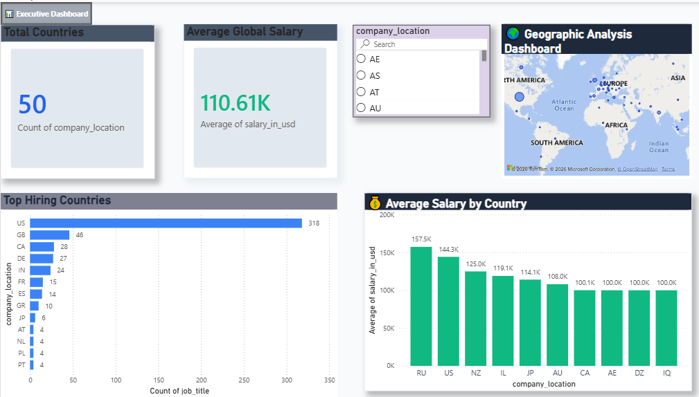

<div align="center">

# 🚀 DataCareer Insights

### End-to-End Data Engineering Project

Analyze • Transform • Store • Visualize • Generate Insights


</div>

---

# 📖 Overview

**DataCareer Insights** is an **End-to-End Data Engineering Project** that analyzes global **Data Science, Analytics, and Data Engineering salary trends**.

The project demonstrates the complete Data Engineering workflow by extracting, cleaning, transforming, loading, and analyzing real-world datasets using **Python**, **PostgreSQL**, **SQL**, and **Power BI**.

It showcases practical skills in **ETL development**, **database management**, **SQL analytics**, and **business intelligence reporting**.

---

# 🎯 Project Objectives

This project answers key business questions, including:

- Which Data roles offer the highest salaries?
- How does experience level impact compensation?
- What percentage of jobs are Remote, Hybrid, and Onsite?
- How does company size affect hiring?
- What insights can job seekers gain from salary trends?

---

# 🛠 Technology Stack

| Category | Technologies |
|-----------|--------------|
| Programming | Python |
| Data Processing | Pandas |
| Database | PostgreSQL |
| Database Connectivity | SQLAlchemy, Psycopg2 |
| Query Language | SQL |
| Visualization | Power BI |
| Version Control | Git & GitHub |

---

# 📂 Project Structure

```text
DataCareer-Insights/
│
├── analytics/
│   ├── top_paying_jobs.py
│   ├── salary_by_experience.py
│   ├── remote_analysis.py
│   └── company_size_analysis.py
│
├── data/
│   ├── ds_salaries.csv
│   ├── cleaned_ds_salaries.csv
│   ├── top_paying_jobs.csv
│   ├── salary_by_experience.csv
│   ├── remote_analysis.csv
│   └── company_size_analysis.csv
│
├── dashboard/
│
├── docs/
│
├── etl/
│   ├── load_data.py
│   ├── clean_data.py
│   ├── load_to_postgres.py
│   └── test_db_connection.py
│
├── screenshots/
│
├── sql/
│   ├── top_paying_jobs.sql
│   ├── salary_by_experience.sql
│   ├── remote_work_analysis.sql
│
├── README.md
├── requirements.txt
└── .gitignore
```

---

# 🔄 ETL Pipeline Architecture

```text
                     Raw CSV Dataset
                            │
                            ▼
                 Python (Pandas ETL)
                            │
                            ▼
             Data Cleaning & Validation
                            │
                            ▼
                  PostgreSQL Database
                            │
                            ▼
                    SQL Analytics Layer
                            │
                            ▼
                 Automated CSV Reports
                            │
                            ▼
                  Power BI Dashboard
                            │
                            ▼
                    Business Insights
```

---

# 📊 Dashboard Preview

## Executive Dashboard

<p align="center">

</p>

---

## Geographic Analysis

<p align="center">

</p>

---

# 🧹 Data Cleaning Process

The dataset was cleaned and transformed using **Python** and **Pandas**.

### Cleaning Activities

- Removed unnecessary columns
- Removed duplicate records
- Validated missing values
- Standardized dataset structure
- Prepared analytical dataset for PostgreSQL

### Dataset Statistics

| Description | Count |
|------------|------:|
| Original Records | 607 |
| Cleaned Records | 565 |
| Removed Records | 42 |

---

# 📈 SQL Analytics

The project includes SQL queries for:

- Highest Paying Job Titles
- Salary by Experience Level
- Remote Work Distribution
- Company Size Analysis

---

# 📊 Power BI Dashboard

The interactive dashboard provides insights into the global Data job market.

### KPI Cards

- Total Jobs
- Average Salary
- Remote Jobs
- Medium Companies

### Visualizations

- Salary Growth by Experience Level
- Work Mode Distribution
- Company Size Distribution
- Key Business Insights

---

# 📊 Key Business Insights

## 💰 Top Paying Roles

| Rank | Job Title | Average Salary (USD) |
|------|----------------------------|----------------:|
| 1 | Principal Data Engineer | 328,333 |
| 2 | Financial Data Analyst | 275,000 |
| 3 | Principal Data Scientist | 215,242 |
| 4 | Director of Data Science | 195,074 |
| 5 | Data Architect | 177,874 |

---

## 🌍 Remote Work Distribution

| Work Mode | Jobs |
|-----------|----:|
| Remote | 346 |
| Hybrid | 98 |
| Onsite | 121 |

**Insight:** More than **61%** of jobs in the dataset were fully remote.

---

## 🏢 Company Size Analysis

| Company Size | Jobs |
|--------------|----:|
| Medium | 290 |
| Large | 193 |
| Small | 82 |

**Insight:** Medium-sized companies posted the highest number of job opportunities.

---

# 🎯 Project Highlights

- Processed and analyzed **565** real-world job records.
- Built an automated **ETL pipeline** using Python and PostgreSQL.
- Developed SQL-based analytical reports for business insights.
- Created an interactive **Power BI Dashboard**.
- Implemented Git and GitHub for version control.
- Generated meaningful insights from real-world salary data.

---

# 🚀 How to Run

```bash
# Clone the repository
git clone https://github.com/sumeet2436/DataCareer-Insights.git

# Navigate to project folder
cd DataCareer-Insights

# Install dependencies
pip install -r requirements.txt

# Run ETL scripts
python etl/load_data.py

# Run analytics
python analytics/top_paying_jobs.py
```

---

# 📌 Future Improvements

- Apache Airflow integration
- Docker containerization
- Live dashboard deployment
- Automated ETL scheduling
- Cloud database integration

---

# 👨‍💻 Author

## Sumeet Gupta

**Data Engineer | Python | SQL | PostgreSQL | Power BI**

💻 GitHub: https://github.com/sumeet2436

🏆 HackerRank: https://www.hackerrank.com/profile/sumeetgupta921

💼 LinkedIn: https://linkedin.com/in/sumeet-gupta-3a2494369

---

⭐ If you found this project useful, consider giving it a **Star** on GitHub.
